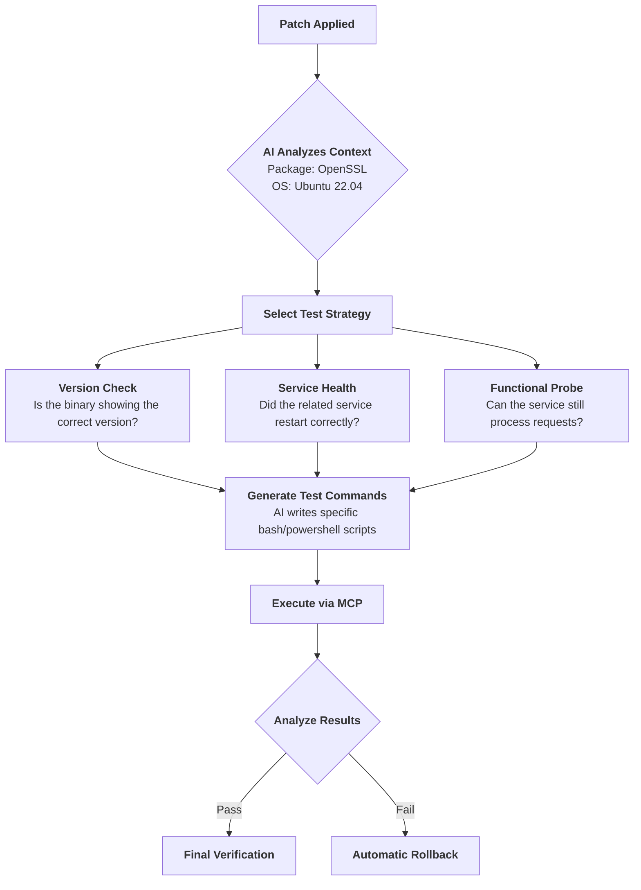

# 🧪 AI-Driven Testing & Validation Protocol

This document explains how the **AI Cyber-Patch Sentinel** autonomously decides what tests to run to ensure a patch is safe and effective.

---

## 1. The Autonomous Decision Engine

Unlike traditional systems that use fixed scripts, the Sentinel uses its **Intelligence Layer** (Cloud Advisor) to design a custom testing strategy for every single patch. The AI asks itself: *"If I update this specific package on this specific OS, what could break?"*

### The Decision Flow

---

## 2. Test Categories Selected by the AI

The AI model dynamically chooses from these categories based on the risk profile of the package:

| Test Category | When the AI Chooses It | Example Command Generated |
| :--- | :--- | :--- |
| **Identity Verification** | Every patch. Ensures the new version is actually active. | `openssl version`, `ssm-cli --version` |
| **Service Heartbeat** | For background services, drivers, or daemons. | `systemctl is-active nginx`, `Get-Service AmazonSSMAgent` |
| **Dependency Check** | For library updates (like libc or OpenSSL) that others depend on. | `ldd /usr/bin/ssh`, `Check for broken links` |
| **Functional Probe** | For high-impact tools (Web Servers, Databases, SSH). | `curl -I localhost:80`, `ssh -V` |
| **Configuration Audit** | When a patch might have overwritten a config file. | `test -f /etc/nginx/nginx.conf` |

---

## 3. Detailed Step-by-Step Logic

### Step A: Strategy Consultation
After a patch is proposed, the Agent Coordinator calls the **Cloud Advisor (GPT-4o)**. It sends an anonymized request:
> *"I am updating 'Amazon SSM Agent' on a 'Windows Server'. Provide 3 validation tests to ensure it is running and healthy."*

### Step B: Command Synthesis
The AI doesn't just suggest ideas; it provides **executable code**. It might return:
1. `Get-Service AmazonSSMAgent | Select-Object -Property Status`
2. `& "C:\Program Files\Amazon\SSM\amazon-ssm-agent.exe" --version`
3. `Test-NetConnection -ComputerName localhost -Port 443` (if applicable)

### Step C: Execution & Self-Correction
The Sentinel executes these commands one by one. If a test fails because of a "minor" reason (like a slow service start), the AI can decide to **wait and retry**. 

### Step D: The "Definition of Done"
A patch is only considered **VERIFIED** if all AI-generated tests return a "Success" exit code (0). If even one test fails, the system treats the entire operation as a failure and triggers the **Rollback Mechanism**.

---

## 4. Why AI-Led Testing?

1.  **Context Awareness**: A test for a Windows driver is very different from a test for a Linux library. The AI knows the difference.
2.  **Zero Maintenance**: You don't need to write test scripts for every software in the world. The AI already knows how they work.
3.  **Risk Mitigation**: The AI identifies "hidden" dependencies that a human might miss, ensuring that fixing one thing doesn't break another.
