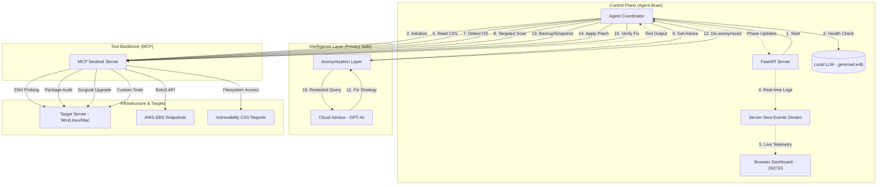

# 🛡️ AI Cyber-Patch Sentinel - Project Flow Guide

This document explains how the **AI Cyber-Patch Sentinel** works, using simple diagrams and non-technical language.

---

## 1. High-Level Flow Diagram

This diagram shows the architectural interaction and the sequential steps of the remediation lifecycle.

---

## 2. How it Works (For Everyone)

Imagine you are a security guard for a large building. You get a report that a specific lock in the building is broken. Here is how the **AI Cyber-Patch Sentinel** handles it:

### Step 1: Reading the Report (Ingest)
The system looks at a list (like a spreadsheet) that says exactly which "room" (server) has a "broken lock" (vulnerability).

### Step 2: Going to the Room (Connect & Detect)
The system "walks" over to that room over a secure path (SSH). Once there, it looks around to see what kind of door it is—is it a wooden door (Linux) or a metal door (Windows)? It needs to know this so it brings the right tools.

### Step 3: Double-Checking (Scan)
Before doing anything, it checks: "Is this lock actually broken?" It makes sure the vulnerable software is really there and needs an update.

### Step 4: Asking an Expert (Advise)
The system sends a picture of the lock (but hides the room number for privacy!) to a master locksmith (the Cloud AI). The locksmith tells the system exactly which part to buy and how to install it.

### Step 5: Taking a "Before" Photo (Snapshot)
This is like a "Save Game" in a video game. The system takes a perfect snapshot of the computer's state. If the new lock doesn't work, we can instantly "teleport" back to exactly how it was before we touched anything.

### Step 6: Fixing the Lock (Patch)
The system replaces the broken part with the new, secure version.

### Step 7: Checking the Work (Verify)
It tries to open and close the door several times. It makes sure the key still works and the door is now locked tight.

### Step 8: Success or Rollback
*   **If everything works:** The system marks the job as done. Your building is now safer!
*   **If the door gets stuck:** The system immediately uses that "Save Game" (Snapshot) to undo everything, putting the old lock back so the door isn't left wide open, and then it asks a human for help.

---

## 3. Why This is Better

1.  **Speed**: It can find and fix problems in minutes, much faster than a human could.
2.  **Safety First**: It **always** makes a backup before changing anything.
3.  **Privacy**: It never shares your secret keys or private addresses with the "Cloud" AI. It keeps all the sensitive stuff on your own machine.
4.  **No Mistakes**: By following a strict 9-phase plan, it ensures no steps are skipped.
