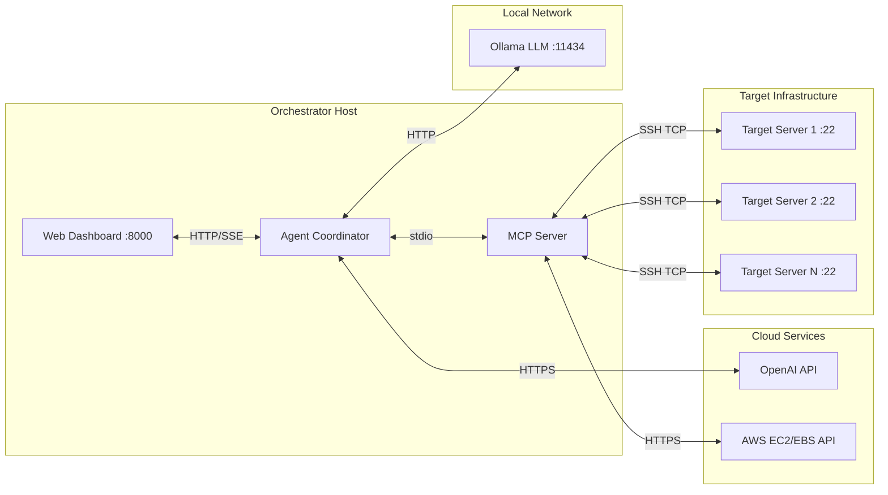

# 🛡️ AI Cyber-Patch Sentinel — Requirements Document

> **Version**: 1.0  
> **Date**: 18 April 2026  
> **Project**: AI Cyber-Patch Sentinel — DevSecOps Automation Platform  
> **Author**: Auto-Generated from Codebase Analysis

---

## 📋 Table of Contents

1. [Overview](#1-overview)
2. [Technical Requirements](#2-technical-requirements)
3. [Server Requirements (Orchestrator Host)](#3-server-requirements-orchestrator-host)
4. [Target Server Requirements](#4-target-server-requirements)
5. [Connectivity Requirements](#5-connectivity-requirements)
6. [Security Requirements](#6-security-requirements)
7. [Environment Configuration Reference](#7-environment-configuration-reference)
8. [Deployment Checklist](#8-deployment-checklist)

---

## 1. Overview

AI Cyber-Patch Sentinel is a "One-Click Mitigation" platform that automates vulnerability remediation across Linux, Windows, and macOS servers. It operates in two execution modes:

| Mode | Interface | Description |
| :--- | :--- | :--- |
| **Phase 1 — Web Dashboard** | FastAPI + SSE Web UI | Manual orchestration via browser-based dashboard |
| **Phase 2 — Agentic Swarm** | CLI / Programmatic | LLM-driven autonomous remediation via a dual-agent ReAct loop |

> [!IMPORTANT]
> Both modes require the **MCP Sentinel Server** as the tool execution backbone and **SSH access** to the target server(s).

---

## 2. Technical Requirements

### 2.1 Runtime & Language

| Requirement | Minimum | Recommended |
| :--- | :--- | :--- |
| **Python** | 3.12+ | 3.12.x (latest stable) |
| **pip** | 23.0+ | Latest |
| **Virtual Environment** | `venv` or `virtualenv` | `venv` (built-in) |

### 2.2 Python Dependencies

All packages are declared in [requirements.txt](file:///home/bala/Bala/VM_POC/agentic/requirements.txt).

| Package | Version | Purpose |
| :--- | :--- | :--- |
| `mcp[cli]` | ≥ 1.0.0 | MCP protocol backbone (Anthropic SDK) — stdio transport for tool communication |
| `litellm` | ≥ 1.40.0 | Multi-provider LLM orchestration (Ollama local + OpenAI cloud) |
| `paramiko` | ≥ 3.4.0 | SSH client for remote command execution on target servers |
| `fastapi` | ≥ 0.110.0 | Web API server for the browser-based dashboard (Phase 1) |
| `uvicorn` | ≥ 0.28.0 | ASGI server to run the FastAPI application |
| `sse-starlette` | ≥ 2.0.0 | Server-Sent Events for real-time log streaming to the frontend |
| `jinja2` | ≥ 3.1.0 | HTML template engine for the web dashboard |
| `python-multipart` | ≥ 0.0.9 | File upload handling (CSV vulnerability reports) |
| `boto3` | *(implicit)* | AWS SDK for EBS snapshot creation, deletion, and rollback |
| `botocore` | *(implicit)* | Low-level AWS service interface (dependency of boto3) |
| `google-cloud-compute` | *(implicit)* | GCP SDK for Compute Engine disk snapshot operations |
| `loguru` | *(implicit)* | Structured logging across all components |
| `python-dotenv` | *(implicit)* | `.env` file loading for credentials and configuration |

### 2.3 LLM Model Requirements

The system uses a **Dual-Agent Intelligence Architecture**:

| Agent | Model | Provider | Purpose | Location |
| :--- | :--- | :--- | :--- | :--- |
| **Orchestrator** | `gemma4:e4b` | Ollama (Local) | Reasoning, tool selection, ReAct loop execution | On-premise |
| **Cloud Advisor** | `gpt-4o` | OpenAI (Cloud) | Technical intelligence, patch procedures, validation tests | Cloud API |

#### Local LLM (Ollama)

| Requirement | Value |
| :--- | :--- |
| **Runtime** | [Ollama](https://ollama.com/) installed and running |
| **Model** | `gemma4:e4b` (~9.6 GB) preloaded via `ollama pull gemma4:e4b` |
| **Base URL** | `http://localhost:11434` (default) |
| **Context Window** | Configurable — default `4096` tokens (capped for 6 GB VRAM) |
| **GPU Layers** | Configurable — default `-1` (auto), set `0` for CPU-only mode |

> [!TIP]
> If running on a GPU with ≤6 GB VRAM, reduce `OLLAMA_NUM_CTX` to `2048` in the `.env` file to prevent VRAM OOM crashes. Set `OLLAMA_NUM_GPU=0` for full CPU-only operation (slower but zero VRAM).

#### Cloud LLM (OpenAI)

| Requirement | Value |
| :--- | :--- |
| **API Key** | Valid `OPENAI_API_KEY` with GPT-4o access |
| **Model** | `openai/gpt-4o` |
| **Temperature** | `0.3` (semi-deterministic for command generation) |
| **Usage** | Per-patch intelligence consultation only (anonymized data) |

### 2.4 Frontend Technologies (Phase 1 — Web Dashboard)

| Technology | Purpose |
| :--- | :--- |
| HTML5 | Dashboard structure and layout |
| Vanilla CSS | Styling with glassmorphism and dark-mode aesthetics |
| Vanilla JavaScript | Client-side logic, SSE event consumption, API calls |
| Server-Sent Events (SSE) | Real-time log streaming from backend to browser |

---

## 3. Server Requirements (Orchestrator Host)

The **Orchestrator Host** is the machine running the Sentinel platform (Agent Coordinator, MCP Server, Web Dashboard). Three deployment configurations are supported based on available hardware:

### 3.1 Configuration A: High-Performance (Full Local LLM)

> Best for: Production environments, air-gapped deployments, maximum throughput.

| Resource | Specification |
| :--- | :--- |
| **Operating System** | Ubuntu 22.04+ / Debian 12+ |
| **CPU** | 8-Core (x86_64 or ARM64) |
| **RAM** | 32 GB DDR4/DDR5 |
| **GPU (VRAM)** | 12 GB+ VRAM (NVIDIA RTX 3060+, RTX 4070+, or A-series) |
| **Disk** | 500 GB SSD (NVMe preferred) |
| **LLM Model** | `gemma4:e4b` (9.6 GB, full GPU offload) |
| **Context Window** | `8192` tokens |
| **Est. Token/Patch** | ~1200 tokens |

### 3.2 Configuration B: Balanced (Hybrid GPU/CPU)

> Best for: Development, testing, laptops with mid-range GPUs.

| Resource | Specification |
| :--- | :--- |
| **Operating System** | Ubuntu 22.04+ / Debian 12+ |
| **CPU** | 6-Core (x86_64) |
| **RAM** | 16 GB DDR4 |
| **GPU (VRAM)** | 8 GB VRAM (NVIDIA RTX 4050 Laptop, RTX 3060) |
| **Disk** | 250 GB SSD |
| **LLM Model** | `gemma4:e4b` (partial GPU offload) or `gemma2:9b` |
| **Context Window** | `4096` tokens |
| **Est. Token/Patch** | ~1760 tokens |

> [!WARNING]
> On 6 GB VRAM GPUs (e.g., RTX 4050 Laptop), the `gemma4:e4b` model may cause VRAM OOM. Use `OLLAMA_NUM_CTX=2048` and consider `OLLAMA_NUM_GPU=24` (partial GPU offload) for stability.

### 3.3 Configuration C: Lean / Cloud-First (No Local Model)

> Best for: Pure cloud deployments where all LLM inference is outsourced to OpenAI.

| Resource | Specification |
| :--- | :--- |
| **Operating System** | Ubuntu 22.04+ / Debian 12+ |
| **CPU** | 4-Core |
| **RAM** | 8–12 GB (asyncio event loop + network buffers) |
| **GPU** | **None Required** |
| **Disk** | 100 GB SSD |
| **LLM Model** | Cloud-only (GPT-4o via API) |
| **Context Window** | N/A (managed by OpenAI) |
| **Est. Token/Patch** | ~2250 tokens (billed per API call) |

> [!NOTE]
> Configuration C requires a stable internet connection to OpenAI's API at all times. It is **not suitable** for air-gapped or isolated environments.

### 3.4 Summary Comparison

| Attribute | Config A | Config B | Config C |
| :--- | :--- | :--- | :--- |
| RAM | 32 GB | 16 GB | 8–12 GB |
| GPU | 12 GB VRAM | 8 GB VRAM | None |
| CPU | 8-Core | 6-Core | 4-Core |
| Disk | 500 GB | 250 GB | 100 GB |
| Local LLM | ✅ Full | ✅ Partial | ❌ Cloud-only |
| Air-gap Ready | ✅ | ✅ | ❌ |
| Cost/Patch | $0 (local) | $0 (local) | ~$0.01–$0.05 |

---

## 4. Target Server Requirements

These are the **remote servers** being remediated by the Sentinel platform.

### 4.1 Supported Operating Systems

| OS Family | Distributions | Package Manager | Status |
| :--- | :--- | :--- | :--- |
| **Debian** | Debian 12/13, Ubuntu 22.04/24.04, Linux Mint, Pop!_OS, Kali | `apt` | ✅ Fully Tested |
| **RHEL** | RHEL 8/9, CentOS Stream, Fedora 38+, Rocky, AlmaLinux | `dnf` / `yum` | ✅ Supported |
| **Arch** | Arch Linux, Manjaro, EndeavourOS | `pacman` | ✅ Supported |
| **SUSE** | openSUSE Leap/Tumbleweed | `zypper` | ✅ Supported |
| **Alpine** | Alpine Linux 3.18+ | `apk` | ✅ Supported |
| **macOS** | macOS 13+ (Ventura+) | `brew` | ⚠️ Experimental |
| **Windows** | Windows Server 2019/2022, Windows 10/11 | `winget` / `choco` | ✅ Tested (winget) |

### 4.2 Target Server Minimum Requirements

| Requirement | Value |
| :--- | :--- |
| **SSH Server** | OpenSSH 8.0+ (Linux/macOS), OpenSSH for Windows (Win Server) |
| **SSH Port** | Default `22` (configurable via `TARGET_PORT`) |
| **Authentication** | Password-based **or** SSH key-based (RSA, Ed25519, ECDSA) |
| **User Privileges** | `root` or user with `sudo` NOPASSWD for package management |
| **Network** | Accessible from the Orchestrator Host (direct or via VPN/bastion) |
| **Package Manager** | Functional and configured (repos/sources must be reachable) |

> [!CAUTION]
> The target server **must** have a working package manager with accessible repositories. Disconnected targets with no network access to package repos will fail during the SCAN and PATCH phases.

---

## 5. Connectivity Requirements

### 5.1 Network Topology



### 5.2 Connectivity Matrix

| Source | Destination | Protocol | Port(s) | Direction | Required |
| :--- | :--- | :--- | :--- | :--- | :--- |
| **Orchestrator** → **Target Server** | N/A | SSH (TCP) | `22` (configurable) | Outbound | ✅ **Mandatory** |
| **Orchestrator** → **Ollama** | `localhost` | HTTP | `11434` | Loopback | ✅ Required for local LLM |
| **Orchestrator** → **OpenAI API** | `api.openai.com` | HTTPS | `443` | Outbound | ✅ Required for Cloud Advisor |
| **Orchestrator** → **AWS API** | `ec2.{region}.amazonaws.com` | HTTPS | `443` | Outbound | ⚠️ Optional (for AWS EBS snapshots) |
| **Orchestrator** → **GCP API** | `compute.googleapis.com` | HTTPS | `443` | Outbound | ⚠️ Optional (for GCP disk snapshots) |
| **Browser** → **Web Dashboard** | Orchestrator IP | HTTP/SSE | `8000` | Inbound | ✅ Required for Phase 1 UI |
| **Target Server** → **Package Repos** | Various | HTTP/HTTPS | `80`/`443` | Outbound | ✅ Required for patching |

### 5.3 SSH Connectivity (Critical Path)

The SSH connection is the **single most critical** communication channel. All remediation actions (detection, scanning, patching, verification) flow through it.

| Parameter | Environment Variable | Default | Description |
| :--- | :--- | :--- | :--- |
| Host | `TARGET_HOST` | `127.0.0.1` | Target server IP or hostname |
| Port | `TARGET_PORT` | `22` | SSH port |
| Username | `TARGET_USER` | `root` | SSH username |
| Password | `TARGET_PASSWORD` | — | Password for SSH auth |
| SSH Key | `TARGET_KEY_PATH` | — | Path to private key file (RSA, Ed25519, ECDSA) |

**Authentication Priority Order**:
1. SSH Key (`TARGET_KEY_PATH`) — if set, used first
2. Password (`TARGET_PASSWORD`) — fallback if no key
3. SSH Agent — used if neither key nor password are set

**Connection Resilience**:
- Connection timeout: **30 seconds**
- Command execution timeout: **120 seconds** (default), **300 seconds** (patching), **180 seconds** (scanning)
- SSH sessions are **cached** per `user@host:port` to avoid repeated handshakes
- Dead connections are auto-detected and re-established

### 5.4 AWS API Connectivity (Optional)

Required **only** if using AWS EBS Snapshots for pre-patch backups.

| Parameter | Environment Variable | Description |
| :--- | :--- | :--- |
| Access Key ID | `AWS_ACCESS_KEY_ID` | IAM user or role access key |
| Secret Access Key | `AWS_SECRET_ACCESS_KEY` | IAM secret key |
| Region | `AWS_DEFAULT_REGION` | AWS region (e.g., `eu-north-1`, `us-east-1`) |

**Required IAM Permissions**:

```json
{
  "Version": "2012-10-17",
  "Statement": [
    {
      "Effect": "Allow",
      "Action": [
        "ec2:DescribeInstances",
        "ec2:CreateSnapshot",
        "ec2:DeleteSnapshot",
        "ec2:DescribeSnapshots",
        "ec2:CreateVolume",
        "ec2:AttachVolume",
        "ec2:DetachVolume",
        "ec2:StopInstances",
        "ec2:StartInstances"
      ],
      "Resource": "*"
    }
  ]
}
```

> [!NOTE]
> If AWS snapshots are not used, the system can fall back to **GCP snapshots**, **tar-based local backups** (Linux), or **System Restore Points** (Windows).

### 5.5 GCP API Connectivity (Optional)

Required **only** if using GCP Compute Engine Disk Snapshots for pre-patch backups (alternative to AWS EBS).

| Parameter | Environment Variable | Description |
| :--- | :--- | :--- |
| Project ID | `GCP_PROJECT_ID` | GCP project containing the target VM instances |
| Service Account Key | `GOOGLE_APPLICATION_CREDENTIALS` | Path to the JSON service account key file |
| Zone | `GCP_ZONE` | Compute Engine zone (e.g., `us-central1-a`, `europe-west1-b`) |

**Required IAM Roles** (assign to the service account):

| IAM Role | Purpose |
| :--- | :--- |
| `roles/compute.instanceAdmin.v1` | Stop/start instances during rollback |
| `roles/compute.storageAdmin` | Create, delete, and manage disk snapshots |
| `roles/compute.viewer` | List instances and disks to resolve IPs |

**Equivalent granular permissions** (if using a custom role):

```yaml
# GCP Custom Role — Sentinel Snapshot Manager
title: Sentinel Snapshot Manager
includedPermissions:
  - compute.instances.get
  - compute.instances.list
  - compute.instances.stop
  - compute.instances.start
  - compute.disks.get
  - compute.disks.list
  - compute.disks.createSnapshot
  - compute.snapshots.create
  - compute.snapshots.delete
  - compute.snapshots.get
  - compute.snapshots.list
  - compute.snapshots.useReadOnly
```

**Authentication Methods** (in priority order):
1. **Service Account Key JSON** — set via `GOOGLE_APPLICATION_CREDENTIALS=/path/to/key.json`
2. **Workload Identity** — for GKE-based orchestrator deployments (no key file needed)
3. **Application Default Credentials (ADC)** — `gcloud auth application-default login` for local development

> [!NOTE]
> If neither AWS nor GCP credentials are configured, the system automatically falls back to **tar-based local backups** on the target server (Linux) or **System Restore Points** (Windows). No cloud credentials are needed in this fallback mode.

### 5.6 OpenAI API Connectivity

| Parameter | Environment Variable | Description |
| :--- | :--- | :--- |
| API Key | `OPENAI_API_KEY` | OpenAI project API key with GPT-4o access |

**Endpoint**: `https://api.openai.com/v1/chat/completions`  
**Estimated usage**: ~2000–2500 tokens per vulnerability patch cycle  
**Privacy**: All data sent to OpenAI passes through the **Anonymization Layer** which redacts:
- IPv4 addresses → `[REDACTED_IP]`
- Email addresses → `[REDACTED_EMAIL]`
- SSH usernames and credentials → **never transmitted**

### 5.7 Firewall Rules Summary

```
# ── OUTBOUND FROM ORCHESTRATOR ──────────────────────────────
# SSH to target servers (MANDATORY)
ALLOW  OUT  TCP  dest_port=22        → Target Server IPs

# Ollama local LLM (loopback, always allowed)
ALLOW  OUT  TCP  dest_port=11434     → 127.0.0.1

# OpenAI Cloud Advisor (REQUIRED for intelligence)
ALLOW  OUT  TCP  dest_port=443       → api.openai.com

# AWS EBS Snapshots (OPTIONAL — choose AWS or GCP)
ALLOW  OUT  TCP  dest_port=443       → ec2.*.amazonaws.com

# GCP Disk Snapshots (OPTIONAL — choose AWS or GCP)
ALLOW  OUT  TCP  dest_port=443       → compute.googleapis.com
ALLOW  OUT  TCP  dest_port=443       → oauth2.googleapis.com

# ── INBOUND TO ORCHESTRATOR ──────────────────────────────────
# Web Dashboard access (Phase 1)
ALLOW  IN   TCP  dest_port=8000      → Admin Workstations

# ── OUTBOUND FROM TARGET SERVERS ──────────────────────────────
# Package repository access (MANDATORY for patching)
ALLOW  OUT  TCP  dest_port=80,443    → Package Repo Mirrors
```

---

## 6. Security Requirements

### 6.1 Credential Management

| Credential | Storage | Transmission | Cloud Exposure |
| :--- | :--- | :--- | :--- |
| SSH Passwords | `.env` file (local) | Encrypted SSH channel | ❌ Never sent |
| SSH Private Keys | Local filesystem | Used locally by Paramiko | ❌ Never sent |
| AWS Keys | `.env` file (local) | HTTPS to AWS API | ❌ Never sent to LLM |
| GCP Service Key | JSON file (local) | HTTPS to GCP API | ❌ Never sent to LLM |
| OpenAI API Key | `.env` file (local) | HTTPS to OpenAI | N/A (API auth only) |
| Target IPs | `.env` / CSV file | SSH channel only | ❌ Anonymized before cloud |

### 6.2 Data Anonymization

Before any data is sent to the Cloud Advisor (GPT-4o), the **Anonymization Layer** applies:

| Data Type | Pattern | Replacement |
| :--- | :--- | :--- |
| IPv4 Addresses | `\d{1,3}\.\d{1,3}\.\d{1,3}\.\d{1,3}` | `[REDACTED_IP]` |
| Email Addresses | `[a-zA-Z0-9._%+-]+@[...]` | `[REDACTED_EMAIL]` |
| SSH Credentials | — | **Never included** in prompts |

### 6.3 SSH Security

- **Host Key Verification**: Currently set to `AutoAddPolicy` (accepts all host keys). For production, implement `RejectPolicy` with a known-hosts file.
- **Key Types Supported**: RSA, Ed25519, ECDSA (tried in order)
- **Connection Caching**: Active SSH sessions are cached per `user@host:port` with health checks

> [!WARNING]
> The default `AutoAddPolicy` for SSH host keys is **not recommended for production**. It makes the system vulnerable to MITM attacks. Configure a known-hosts file or use `RejectPolicy` in hardened environments.

---

## 7. Environment Configuration Reference

All configuration is managed via the `.env` file located at `agentic/.env`.

```ini
# ── Target Server ─────────────────────────────────────────
TARGET_HOST=<IP or hostname>         # Target server address
TARGET_PORT=22                       # SSH port (default: 22)
TARGET_USER=root                     # SSH username
TARGET_PASSWORD=<password>           # SSH password (or use key)
TARGET_KEY_PATH=                     # Path to SSH private key

# ── LLM Configuration ────────────────────────────────────
LLM_MODEL=ollama/gemma4:e4b          # Local orchestrator model
OLLAMA_BASE_URL=http://localhost:11434  # Ollama API endpoint
OPENAI_API_KEY=sk-proj-xxxxx         # OpenAI API key for Cloud Advisor

# ── VRAM / Resource Limits ────────────────────────────────
OLLAMA_NUM_CTX=4096                  # Context window (↓ = less VRAM)
OLLAMA_NUM_GPU=-1                    # GPU layers (-1=auto, 0=CPU-only)
LLM_MAX_TOKENS=2048                  # Max response tokens
MAX_HISTORY_MESSAGES=20              # ReAct loop history cap

# ── AWS Configuration (Optional — for EBS snapshots) ──────
AWS_ACCESS_KEY_ID=<key>              # IAM access key
AWS_SECRET_ACCESS_KEY=<secret>       # IAM secret key
AWS_DEFAULT_REGION=eu-north-1        # AWS region

# ── GCP Configuration (Optional — for disk snapshots) ─────
GCP_PROJECT_ID=<project-id>          # GCP project ID
GCP_ZONE=us-central1-a               # Compute Engine zone
GOOGLE_APPLICATION_CREDENTIALS=/path/to/service-account-key.json
```

---

## 8. Deployment Checklist

Use this checklist before running the Sentinel platform for the first time:

### Orchestrator Host Setup

- [ ] Python 3.12+ installed and `python --version` confirmed
- [ ] Virtual environment created: `python -m venv agentic/venv`
- [ ] Dependencies installed: `pip install -r requirements.txt`
- [ ] `.env` file populated with all required variables
- [ ] Ollama installed and running: `ollama serve`
- [ ] Model pulled: `ollama pull gemma4:e4b`
- [ ] Ollama health check: `curl http://localhost:11434/api/tags`

### Connectivity Verification

- [ ] SSH to target server works: `ssh -p <PORT> <USER>@<HOST>`
- [ ] OpenAI API key is valid: test with a simple API call
- [ ] AWS credentials are valid (if using EBS): `aws sts get-caller-identity`
- [ ] GCP credentials are valid (if using snapshots): `gcloud auth application-default print-access-token`
- [ ] Web dashboard port `8000` is accessible from admin workstation

### Target Server Readiness

- [ ] SSH server running and accessible from orchestrator
- [ ] User has root or sudo NOPASSWD privileges
- [ ] Package manager functional: `apt update` / `dnf check-update` / `winget list`
- [ ] Package repositories are reachable (internet or local mirror)

### Vulnerability Report

- [ ] CSV file prepared with columns: `IP`, `Description`
- [ ] Description format: `Package: <name> | Status: Vulnerable (<version>) | Remediation: Update to <version>`
- [ ] CSV uploaded via Web Dashboard **or** placed in `agentic/vul_csv/`

---

> [!TIP]
> For quick validation, run the Agentic Swarm first (`python agent_coordinator.py`) to confirm all connectivity before deploying the Web Dashboard.
