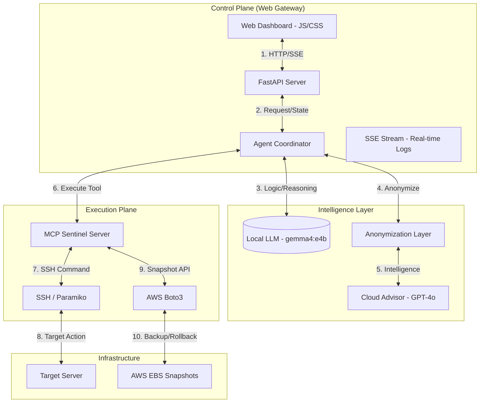

# 🛡️ AI Cyber-Patch Sentinel — Agentic Swarm (Phase 2) Flow & Documentation

This document provides a comprehensive technical guide to the **Agentic Swarm** architecture and its autonomous remediation lifecycle, powered by **FastAPI** and the **Dual-Agent Intelligence Model**.

---

## 1. System Architecture & Sequential Flow
This diagram illustrates the component interaction and the sequential flow (1-9) of the remediation process.

---

## 2. The 9-Phase Remediation Lifecycle
The swarm operates on a deterministic 9-phase state machine. Every transition is broadcasted via **SSE** to the web dashboard.

### Phase 1: INGEST (CSV Ingestion)
*   **Action**: The Coordinator reads the vulnerability report (e.g., `sec-1123.csv`).
*   **Goal**: Identify target IP, package name, and CVE reference.
*   **Tool**: `read_vulnerability_csv`

### Phase 2: DETECT (OS Fingerprinting)
*   **Action**: The system establishes an SSH connection to the target server.
*   **Goal**: Detect OS family (Ubuntu, RHEL, Windows), Kernel version, and the default Package Manager (`apt`, `dnf`, `winget`).
*   **Tool**: `detect_os`

### Phase 3: SCAN (Targeted Audit)
*   **Action**: Runs a surgical scan for the specific package identified in Phase 1.
*   **Goal**: Confirm the package is installed and is indeed an updatable version.
*   **Tool**: `run_vulnerability_scan`

### Phase 4: ADVISE (Intelligence Consultation)
*   **Action**: The Coordinator redacts sensitive data (IPs/credentials) and sends a prompt to the Cloud Advisor.
*   **Goal**: Receive a specific list of shell commands (`PROCEDURE`) and a validation script (`VALIDATION`).
*   **Tool**: `consult_advisor` (GPT-4o)

### Phase 5: SNAPSHOT (Safety Net)
*   **Action**: Triggers an AWS EBS Snapshot or a local tar-based backup.
*   **Goal**: Ensure a point-in-time recovery state before modifying the system.
*   **Tool**: `create_aws_snapshot` or `create_snapshot`

### Phase 6: PATCH (Surgical Remediation)
*   **Action**: Executes the upgrade commands received from Phase 4.
*   **Goal**: Upgrade the vulnerable package to a secure version.
*   **Tool**: `deploy_patch` or `install_manual_package`

### Phase 7: VERIFY (Post-Patch Validation)
*   **Action**: Runs the validation test provided by the Cloud Advisor.
*   **Goal**: Confirm the service is operational and the patch is effective.
*   **Tool**: `run_custom_test`

### Phase 8: CLEANUP (Resource Optimization)
*   **Action**: Deletes the temporary pre-patch snapshots once verification is complete.
*   **Goal**: Reduce cloud storage costs and maintain infrastructure hygiene.
*   **Tool**: `delete_aws_snapshot`

### Phase 9: REPORT (Final Synchronization)
*   **Action**: Updates the internal state to `VERIFIED` and pushes the final summary to the Web Dashboard.
*   **Goal**: Complete the lifecycle and log the remediation details.

---

## 3. Security & Privacy Controls
*   **Data Anonymization**: The **Anonymization Layer** redacts IPv4 addresses and SSH usernames before sending any data to the Cloud Advisor (GPT-4o).
*   **Local Secret Management**: SSH keys and passwords never leave the local machine; they are handled exclusively by the **MCP Sentinel Server**.
*   **One-Click Mitigation**: The system is designed to be fully autonomous but provides real-time visibility so a human operator can intervene if an `ERROR` state is reached.

---

## 4. State Machine Mapping
The UI updates its "Phase Indicator" based on these internal state transitions:

| State | Lifecycle Stage | Triggering Event |
| :--- | :--- | :--- |
| **IDLE** | Ready | System started. |
| **DETECTING** | Phase 2 | OS detection tool called. |
| **SCANNING** | Phase 3 | Package scan tool called. |
| **SCANNED** | Phase 4 | Scan confirmed package presence. |
| **SNAPSHOTTING** | Phase 5 | Backup creation triggered. |
| **SNAPSHOT_READY** | Phase 5 | Backup successfully verified. |
| **PATCHING** | Phase 6 | Deployment commands executing. |
| **PATCHED** | Phase 7 | Patch finished, verification starting. |
| **VERIFIED** | Phase 9 | All tests passed; mission complete. |
| **ERROR** | Failure | Any tool returns a non-zero exit code or error. |
