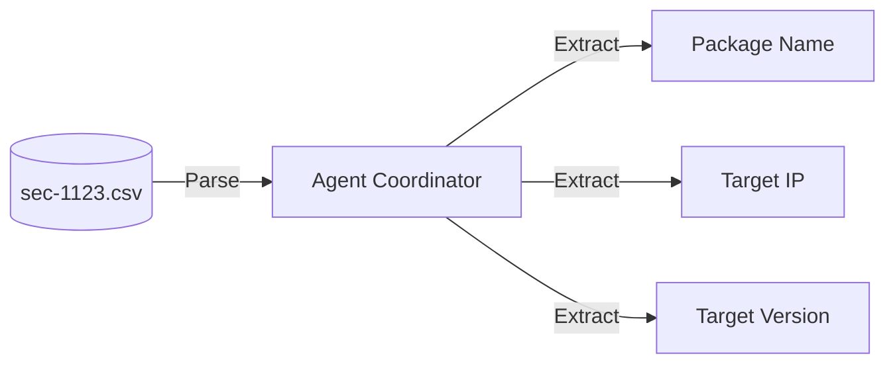
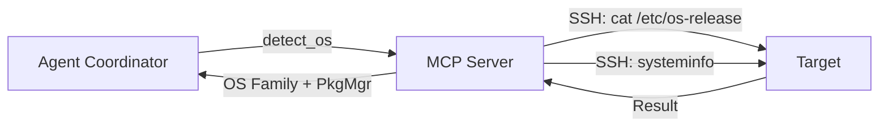
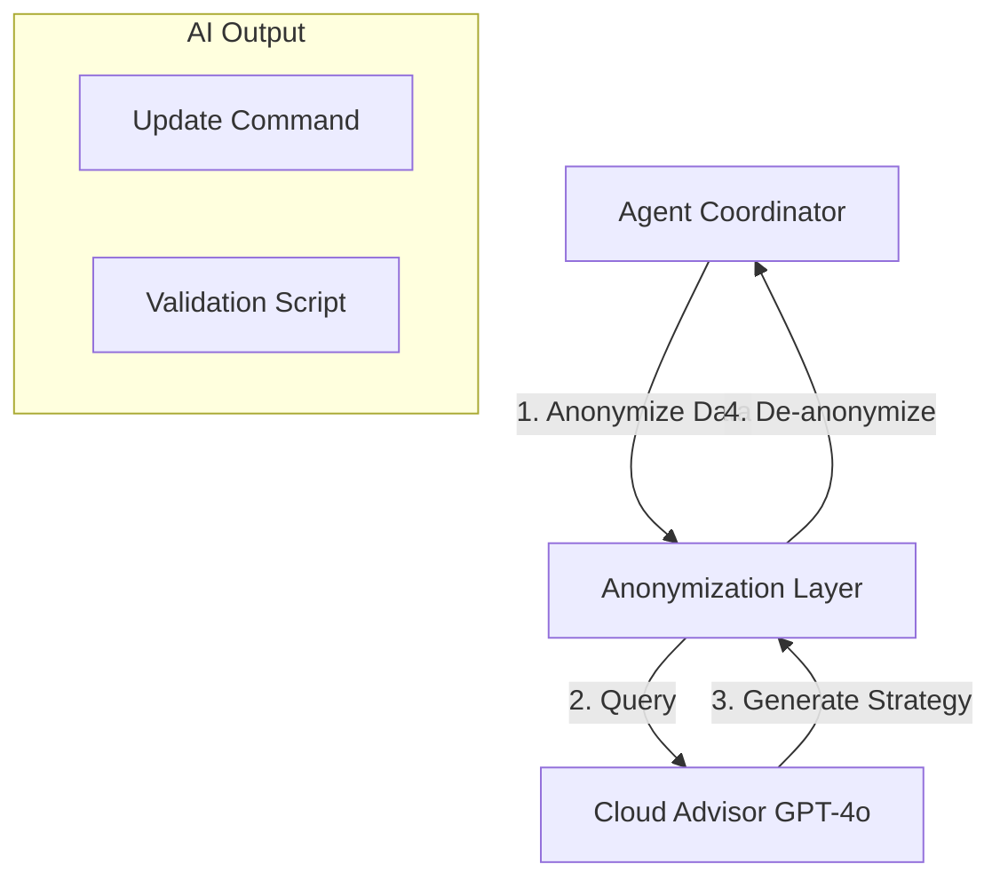
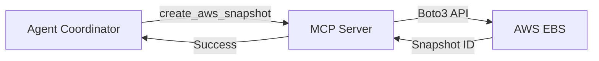
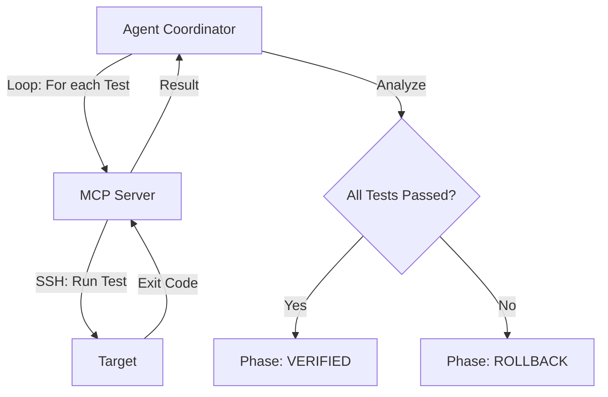
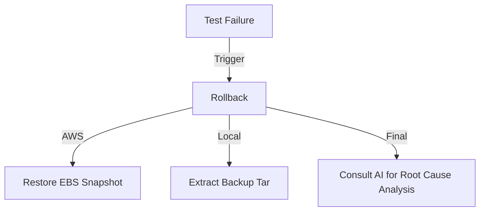

# 🛠️ Sentinel Technical Workflow & AI Logic

This document provides a deep technical dive into the **AI Cyber-Patch Sentinel** remediation pipeline. Each phase is broken down by its logic, tool usage, and visual flow.

---

## Phase 1: Ingestion & Target Mapping
The system reads the vulnerability report to build the initial execution context.

*   **Logic**: Uses `read_vulnerability_csv` to map CSV columns to a structured `VulnerabilityRecord` Pydantic model.
*   **Output**: A list of targets to be processed in the ReAct loop.

---

## Phase 2: Remote OS Fingerprinting
The system probes the target to determine the environment-specific tools needed.

*   **Logic**: Executes a "Waterfall Probe" (Linux → macOS → Windows).
*   **Technicals**: Identifies the package manager (`apt`, `dnf`, `winget`, `choco`) to ensure the correct patching commands are used later.

---

## Phase 3: AI Strategy Synthesis (The Brain)
The Coordinator consults the AI to determine the best fix and the validation required.

*   **Logic**: The AI is given the package name, current version, and OS. It returns a JSON structure containing the `upgrade_command` and a list of `validation_tests`.
*   **Privacy**: All IPs and credentials are redacted before the query leaves the local machine.

---

## Phase 4: Pre-Patch Safety Net (Snapshots)
Before modifying the system, a restorable state is created.

*   **Logic**: For AWS targets, it locates the EC2 instance by IP and triggers snapshots of all attached EBS volumes.
*   **Local Alternative**: On Linux, it creates a `tar.gz` of `/etc` and the package database.

---

## Phase 5: AI-Driven Testing & Validation
**This is the most critical phase.** The AI model decides the testing criteria based on the package type.

### AI Testing Logic:
The AI model categorizes the package and generates specific tests:
1.  **Binary Verification**: `[pkg] --version` to ensure the new version is active.
2.  **Service Verification**: `systemctl is-active [service]` to ensure background processes restarted.
3.  **Port Verification**: `netstat -tuln` to check if the application is listening on its expected port.
4.  **Functional Verification**: Custom scripts like `curl -I localhost:80` for web servers.

---

## Phase 6: Rollback & RCA
If Phase 5 fails, the system automatically reverts the changes.

*   **Logic**: The system uses the Snapshot ID from Phase 4 to restore the volumes.
*   **RCA**: The AI is fed the failure logs to explain *why* the patch failed (e.g., "Library mismatch in Windows Server 2025").

---

## Technical Summary of Tools

| Tool | Responsibility | Platform |
| :--- | :--- | :--- |
| **Paramiko** | SSH transport and remote command execution. | Cross-platform |
| **Boto3** | AWS SDK for EBS Snapshot management. | Cloud (AWS) |
| **LiteLLM** | Unified API for Local (Gemma) and Cloud (GPT-4o) models. | Orchestration |
| **MCP (Model Context Protocol)** | Secure tool execution layer for the LLM. | Control Plane |
