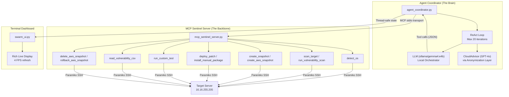
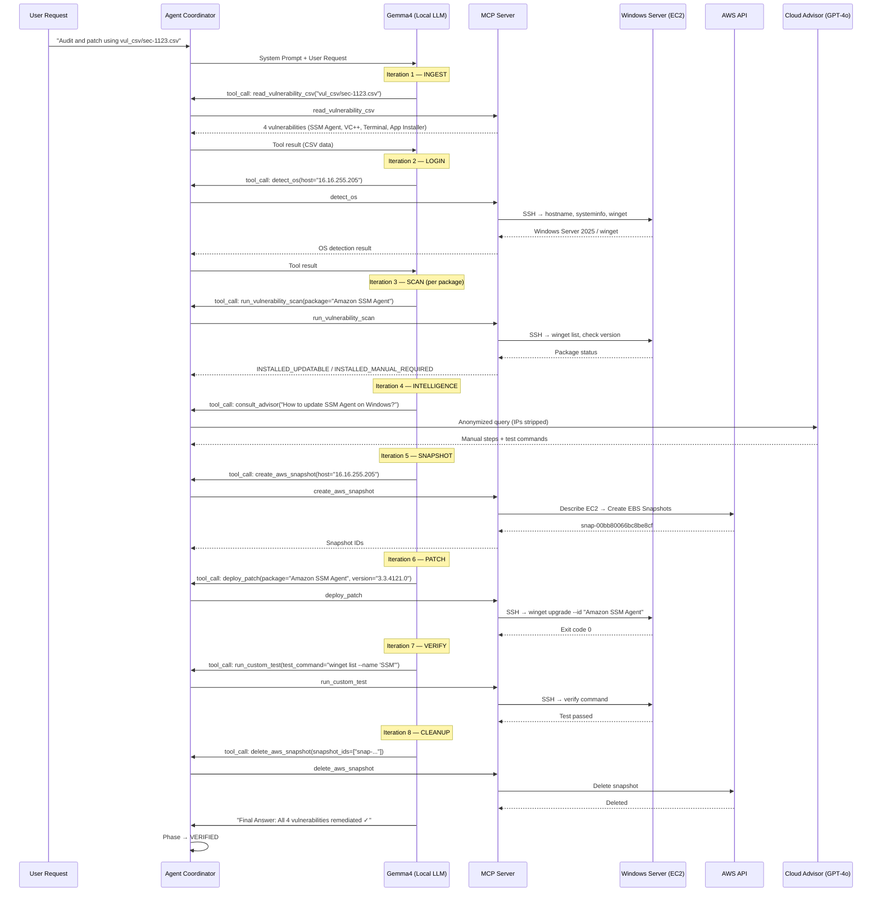
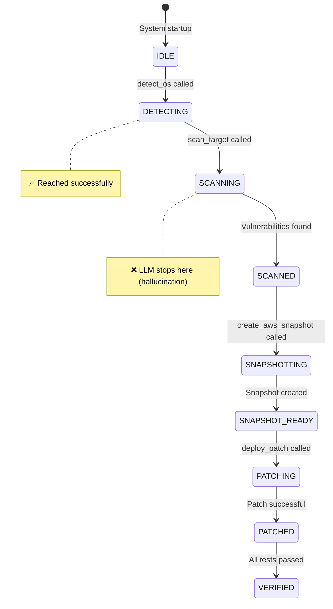

# 🛡️ AI Cyber-Patch Sentinel — Agentic Swarm: Project Flow Analysis

## 1. Architecture Overview

The project is a **Dual-Agent Privacy-Safe Swarm** that automates vulnerability remediation on remote servers (currently targeting a Windows Server 2025 EC2 instance). It uses an LLM-driven **ReAct (Reasoning + Acting)** loop to autonomously ingest vulnerability reports, SSH into targets, detect OS, snapshot, patch, and validate.



---

## 2. Component Breakdown

### 2.1 `agent_coordinator.py` — The Swarm Brain (607 lines)

| Section | Lines | Purpose |
|:---|:---|:---|
| **CloudAdvisor** | 45–80 | Anonymizes prompts (strips IPs & emails via regex), queries GPT-4o for external intelligence |
| **call_mcp_tool()** | 151–197 | Executes MCP tools with **alias mapping** to fix LLM hallucinations (`get_os_info` → `detect_os`) |
| **build_tools_schema()** | 204–229 | Converts MCP tool definitions to OpenAI function-calling format for LiteLLM |
| **llm_completion()** | 232–252 | Async LLM call via LiteLLM (wraps `litellm.completion` in `asyncio.to_thread`) |
| **react_loop()** | 259–357 | The core **ReAct loop** — iterates up to 20 times, calling LLM → executing tools → feeding results back |
| **_inject_defaults()** | 360–372 | Auto-fills SSH connection params (host, user, password) from `.env` if the LLM omits them |
| **_update_dashboard_from_tool()** | 375–473 | Updates the Rich dashboard phase/status based on tool execution results |
| **main()** | 480–606 | Startup: Dashboard → MCP stdio client → LLM test → hardcoded user request → ReAct loop |

### 2.2 `mcp_sentinel_server.py` — The Tool Backbone (1192 lines)

| Tool | Lines | Purpose |
|:---|:---|:---|
| **detect_os** | 176–306 | SSH in, probe `/etc/os-release`, `sw_vers`, `systeminfo` to classify OS family + pkg manager |
| **scan_target** | 332–506 | Run `apt list --upgradable`, `dnf check-update`, `winget upgrade`, etc. and parse results |
| **run_vulnerability_scan** | 512–598 | Targeted check: is a *specific* package installed and updatable? |
| **create_snapshot** | 605–704 | Linux: `tar -czf` backup of `/etc` + pkg state. Windows: PowerShell restore point |
| **deploy_patch** | 711–869 | Surgical upgrade: `apt-get install --only-upgrade`, `winget upgrade --id`, `choco upgrade`, etc. |
| **install_manual_package** | 872–917 | Run arbitrary install commands when the pkg manager doesn't have the version |
| **check_package_usage** | 924–967 | Probe `lsof`, `systemctl`, `which`/`whereis` to find package dependencies |
| **run_custom_test** | 974–999 | Execute a validation command and return pass/fail |
| **read_vulnerability_csv** | 1007–1045 | Parse CSV → extract IP, package, vulnerable version, remediation version via regex |
| **create_aws_snapshot** | 1052–1120 | Look up EC2 instance by IP → create EBS snapshots of all volumes |
| **delete_aws_snapshot** | 1123–1159 | Delete EBS snapshots by ID |
| **rollback_aws_snapshot** | 1162–1182 | Stub for EBS rollback (PoC placeholder) |

### 2.3 `swarm_ui.py` — Rich Terminal Dashboard (290 lines)

- **SwarmState**: Thread-safe singleton holding phase, logs, connection info, MCP status
- **SentinelDashboard**: Background thread running a `Rich.Live` display at 4 FPS
- **Layout**: `Header` (phase/model/time) | `Left` (reasoning log) + `Right` (MCP status) | `Footer` (current action)

---

## 3. End-to-End Flow (Phase 2 Workflow)



---

## 4. Log File Forensic Analysis

### 4.1 Log Files Overview

| Log File | Size | Writer | Purpose |
|:---|:---|:---|:---|
| [agent_coordinator.log](file:///home/bala/Bala/VM_POC/agentic/agent_coordinator.log) | 57 KB (560 lines) | `agent_coordinator.py` | ReAct loop decisions, LLM responses, fatal errors |
| [sentinel_mcp.log](file:///home/bala/Bala/VM_POC/agentic/sentinel_mcp.log) | 9.5 KB (111 lines) | `mcp_sentinel_server.py` | SSH connections, command execution, AWS API calls |
| `swarm_events.log` | 0 KB | `swarm_ui.py` | Dashboard events (currently empty) |
| `orchestrator_stderr.log` | 544 B | MCP subprocess | MCP server process stderr |

### 4.2 Timeline of Runs & Issues

#### 🔴 Phase 1: MCP Connection Failures (13:32 – 13:38)
```
Lines 1-174 in agent_coordinator.log
```
**5 consecutive `McpError: Connection closed`** errors within 6 minutes. The MCP server (child process) was crashing before the coordinator could initialize the session. This was likely due to an import error or missing dependency in the early version of `mcp_sentinel_server.py`.

> [!CAUTION]
> The MCP server was spawned via `stdio_client` but immediately closed the connection pipe, causing cascade failures through asyncio TaskGroups.

#### 🟡 Phase 2: SSH Connection Failures — Wrong Port (13:45 – 15:27)
```
Lines 176-183: "SSH connection failed to 127.0.0.1:2223"
```
The system tried to connect to `127.0.0.1:2223` (the old sandbox Docker container port), but no service was listening. The LLM correctly **stopped and reported the error** per the "never proceed on SSH errors" rule.

#### 🟢 Phase 3: First Successful OS Detection (15:28)
```
sentinel_mcp.log lines 11-16: SSH connected → root@127.0.0.1:22
[detect_os] Result: Debian / apt on bala-Predator-PHN16-71
```
Switched to port 22 (local machine). Successfully detected Debian OS with `apt` package manager.

#### 🟡 Phase 4: AWS Target — Auth Issues (15:32)
```
Line 211: "authentication error" for administrator@16.16.255.205
```
First attempt to reach the production Windows EC2 target. Authentication initially failed, then succeeded on retry.

#### 🟢 Phase 5: Windows Target Fully Detected (15:34 – 18:28)
```
sentinel_mcp.log lines 29-37:
  SSH connected → administrator@16.16.255.205:22
  CMD: hostname → EC2AMAZ-CS89O7J
  CMD: cat /etc/os-release → exit 1 (not Linux)
  CMD: sw_vers → exit 1 (not macOS)
  CMD: systeminfo → exit 0 (Windows!)
  CMD: winget --version → exit 0
  Result: Windows / winget on EC2AMAZ-CS89O7J
```
The OS detection waterfall worked perfectly: Linux check → macOS check → Windows check. Identified **Windows Server 2025 Datacenter** with `winget`.

> [!IMPORTANT]
> **Critical Issue**: The LLM consistently terminated after iteration 2 with a "Final Answer" containing its *plan* to scan, rather than actually calling `scan_target`. It treated its own reasoning as the final output. This happened in 4 consecutive runs (18:29, 19:12, 19:18).

#### 🔴 Phase 6: AWS Snapshot Auth Failures (18:44 – 18:48)
```
sentinel_mcp.log lines 63-70:
  [AWS Error] Credential must have exactly 5 slash-delimited elements
  [AWS Error] ec2:DescribeInstances not authorized for user Bala
```
**Two distinct AWS issues:**
1. **Malformed credential**: The AWS access key was being concatenated incorrectly (included a trailing comma)
2. **Wrong region**: `us-east-1` was tried first, but the instance was in `eu-north-1`
3. **Missing IAM permission**: The user `Bala` lacked `ec2:DescribeInstances` permission

After fixing IAM policies, the snapshot succeeded at **19:02**:
```
[AWS] Created 1 snapshots for i-0cefb2e1204b05103
```

#### 🔴 Phase 7: CSV Tool Bug — `os` Not Imported (19:43 – 19:50)
```
agent_coordinator.log lines 401-411:
  ← read_vulnerability_csv: Error executing tool: name 'os' is not defined
```
The `read_vulnerability_csv` tool used `os.path.exists()` but `import os` was missing in the MCP server scope. This error repeated **3 times** before the run exhausted its iterations. This was fixed by adding `import os` inside the function.

#### 🟢 Phase 8: CSV Ingestion Success + LLM Hallucination Issue (20:11 – 20:36)
```
agent_coordinator.log lines 426-434:
  ← read_vulnerability_csv: 4 vulnerability records found
    - Amazon SSM Agent (3.3.3797.0 → 3.3.4121.0)
    - Microsoft Visual C++ 2015-2022 (14.44 → 14.50)
    - Windows Terminal (1.18 → 1.24)
    - App Installer (1.24 → 1.27)
```
CSV now reads correctly. **BUT** the LLM keeps hallucinating tool names:
- Line 487: `get_system_info` (doesn't exist)
- Line 508: `get_os_info` (aliased but not called — LLM returned it as text, not as a tool call)
- Line 532-535: `get_os_info` again with wrong args

> [!WARNING]
> **Root Cause**: The LLM (gemma4:e4b) returns its intended tool call as a **text blob** (`{"tool_calls": [...]}`) instead of using the proper tool-calling format. The coordinator interprets this as a "final text response" and terminates the loop at iteration 2 every time. The alias mapping in `call_mcp_tool()` never gets a chance to fire because the tool call never reaches the execution path.

---

## 5. State Machine Phases (as observed in logs)



---

## 6. Key Data Flow: Privacy Anonymization

```
┌─── Orchestrator (Local) ───────────────────────────────────┐
│  "Package Amazon SSM Agent on 16.16.255.205 is outdated"   │
└────────────────────┬───────────────────────────────────────┘
                     │ _anonymize()
                     ▼
┌─── Cloud Advisor Query ────────────────────────────────────┐
│  "Package Amazon SSM Agent on [REDACTED_IP] is outdated"   │
└────────────────────┬───────────────────────────────────────┘
                     │ via litellm → OpenAI
                     ▼
┌─── GPT-4o Response ────────────────────────────────────────┐
│  "Run: winget upgrade 'Amazon SSM Agent' --version ..."    │
└────────────────────────────────────────────────────────────┘
```

---

## 7. Current Status & Blockers

| Aspect | Status | Detail |
|:---|:---|:---|
| MCP Server Startup | ✅ Working | Stable stdio transport, 12 tools registered |
| SSH to EC2 Windows | ✅ Working | Paramiko → administrator@16.16.255.205:22 |
| OS Detection | ✅ Working | Correctly identifies Windows Server 2025 + winget |
| CSV Ingestion | ✅ Working | 4 vulns parsed from `sec-1123.csv` |
| AWS Snapshots | ✅ Working | After fixing region (eu-north-1) and IAM permissions |
| LLM Tool Calling | ❌ **Broken** | Gemma4:e4b returns tool calls as text, not structured format |
| Full Pipeline | ❌ **Blocked** | Loop terminates at iteration 2 every run due to LLM issue |
| Cloud Advisor | ⚠️ Untested | Never reached (pipeline stops before INTELLIGENCE phase) |

> [!IMPORTANT]
> **Primary Blocker**: The local LLM (gemma4:e4b) is not properly using OpenAI-style `tool_calls` in its response. It wraps tool invocations as plain text JSON, which the coordinator treats as a "final answer" and exits the ReAct loop. This needs either:
> 1. A stronger local model that supports native function calling
> 2. Response parsing to detect JSON tool calls in text and re-route them
> 3. Switching to a model known to support `tool_choice` properly (e.g., `llama3.1`, `qwen2.5`)
