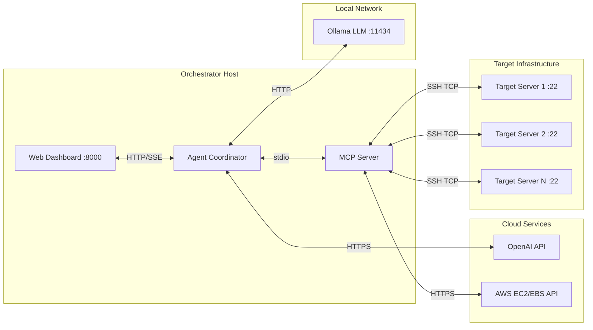

# 🛡️ AI Cyber-Patch Sentinel — Requirements Document

> **Version**: 1.0  
> **Date**: 18 April 2026  
> **Project**: AI Cyber-Patch Sentinel 

---

## 📋 Table of Contents

1. [Overview](#1-overview)
2. [Technical Requirements](#2-technical-requirements)
3. [Server Requirements (Orchestrator Host)](#3-server-requirements-orchestrator-host)
4. [Target Server Requirements](#4-target-server-requirements)
5. [Connectivity Requirements](#5-connectivity-requirements)
6. [Security Requirements](#6-security-requirements)
7. [Environment Configuration Reference](#7-environment-configuration-reference)
8. [Deployment Checklist](#8-deployment-checklist)

---

## 1. Overview

AI Cyber-Patch Sentinel is a "One-Click Mitigation" platform that automates vulnerability remediation across Linux, Windows, and macOS servers. It operates in two execution modes:

| Mode | Interface | Description |
| :--- | :--- | :--- |
| **Phase 1 — Web Dashboard** | FastAPI + SSE Web UI | Manual orchestration via browser-based dashboard |


## 2. Technical Requirements


### 2.1 LLM Model Requirements

The system uses a **Dual-Agent Intelligence Architecture**:

| Agent | Model | Provider | Purpose | Location |
| :--- | :--- | :--- | :--- | :--- |
| **Orchestrator** | `gemma4:e4b` | Ollama (Local) | Reasoning, tool selection, ReAct loop execution | On-premise |
| **Cloud Advisor** | `gpt-4o` | OpenAI (Cloud) | Technical intelligence, patch procedures, validation tests | Cloud API |

#### Local LLM (Ollama)

| Requirement | Value |
| :--- | :--- |
| **Runtime** | [Ollama](https://ollama.com/) installed and running |
| **Model** | `gemma4:e4b` (~9.6 GB) preloaded via `ollama pull gemma4:e4b` |
| **Base URL** | `http://localhost:11434` (default) |
| **Context Window** | Configurable — default `4096` tokens (capped for 6 GB VRAM) |
| **GPU Layers** | Configurable — default `-1` (auto), set `0` for CPU-only mode |


#### Cloud LLM (OpenAI)

| Requirement | Value |
| :--- | :--- |
| **API Key** | Valid `OPENAI_API_KEY` with GPT-4o access |
| **Model** | `openai/gpt-4o` |
| **Temperature** | `0.3` (semi-deterministic for command generation) |
| **Usage** | Per-patch intelligence consultation only |


---

### 3 Configuration A: High-Performance (Full Local LLM)

> Best for: Production environments, air-gapped deployments, maximum throughput.

| Resource | Specification |
| :--- | :--- |
| **Operating System** | Ubuntu 22.04+ / Debian 12+ |
| **CPU** | 8-Core (x86_64 or ARM64) |
| **RAM** | 32 GB DDR4/DDR5 |
| **GPU (VRAM)** | 12 GB+ VRAM (NVIDIA RTX 3060+, RTX 4070+, or A-series) |
| **Disk** | 500 GB SSD (NVMe preferred) |
| **LLM Model** | `gemma4:e4b` (9.6 GB, full GPU offload) |
| **Context Window** | `8192` tokens |
| **Est. Token/Patch** | ~1200 tokens |

### 3.1 Configuration B: Balanced (Hybrid GPU/CPU)

> Best for: Development, testing, laptops with mid-range GPUs.

| Resource | Specification |
| :--- | :--- |
| **Operating System** | Ubuntu 22.04+ / Debian 12+ |
| **CPU** | 6-Core (x86_64) |
| **RAM** | 16 GB DDR4 |
| **GPU (VRAM)** | 8 GB VRAM (NVIDIA RTX 4050 Laptop, RTX 3060) |
| **Disk** | 250 GB SSD |
| **LLM Model** | `gemma4:e4b` (partial GPU offload) or `gemma2:9b` |
| **Context Window** | `4096` tokens |
| **Est. Token/Patch** | ~1760 tokens |


### 3.2 Configuration C: Lean / Cloud-First (No Local Model)

> Best for: Pure cloud deployments where all LLM inference is outsourced to OpenAI.

| Resource | Specification |
| :--- | :--- |
| **Operating System** | Ubuntu 22.04+ / Debian 12+ |
| **CPU** | 4-Core |
| **RAM** | 8–12 GB (asyncio event loop + network buffers) |
| **GPU** | **None Required** |
| **Disk** | 100 GB SSD |
| **LLM Model** | Cloud-only (GPT-4o via API) |
| **Context Window** | N/A (managed by OpenAI) |
| **Est. Token/Patch** | ~2250 tokens (billed per API call) |


### 3.3 Summary Comparison

| Attribute | Config A | Config B | Config C |
| :--- | :--- | :--- | :--- |
| RAM | 32 GB | 16 GB | 8–12 GB |
| GPU | 12 GB VRAM | 8 GB VRAM | None |
| CPU | 8-Core | 6-Core | 4-Core |
| Disk | 500 GB | 250 GB | 100 GB |
| Local LLM | ✅ Full | ✅ Partial | ❌ Cloud-only |
| Air-gap Ready | ✅ | ✅ | ❌ |
| Cost/Patch | $0 (local) | $0 (local) | ~$0.01–$0.05 |

---

### 3.4 Target Server Minimum Requirements

| Requirement | Value |
| :--- | :--- |
| **SSH Server** | OpenSSH 8.0+ (Linux/macOS), OpenSSH for Windows (Win Server) |
| **SSH Port** | Default `22` (configurable via `TARGET_PORT`) |
| **Authentication** | Password-based **or** SSH key-based (RSA, Ed25519, ECDSA) |
| **User Privileges** | `root` or user with `sudo` NOPASSWD for package management |
| **Network** | Accessible from the Orchestrator Host (direct or via VPN/bastion) |
| **Package Manager** | Functional and configured (repos/sources must be reachable) |

> [!CAUTION]
> The target server **must** have a working package manager with accessible repositories. Disconnected targets with no network access to package repos will fail during the SCAN and PATCH phases.

---

## 5. Connectivity Requirements

### 5.1 Network Topology



### 5.2 Connectivity Matrix

| Source | Destination | Protocol | Port(s) | Direction | Required |
| :--- | :--- | :--- | :--- | :--- | :--- |
| **Orchestrator** → **Target Server** | N/A | SSH (TCP) | `22` (configurable) | Outbound | ✅ **Mandatory** |
| **Orchestrator** → **Ollama** | `localhost` | HTTP | `11434` | Loopback | ✅ Required for local LLM |
| **Orchestrator** → **OpenAI API** | `api.openai.com` | HTTPS | `443` | Outbound | ✅ Required for Cloud Advisor |
| **Orchestrator** → **GCP API** | `compute.googleapis.com` | HTTPS | `443` | Outbound | ⚠️ Optional (for GCP disk snapshots) |
| **Browser** → **Web Dashboard** | Orchestrator IP | HTTP/SSE | `8000` | Inbound | ✅ Required for Phase 1 UI |
| **Target Server** → **Package Repos** | Various | HTTP/HTTPS | `80`/`443` | Outbound | ✅ Required for patching |

### 5.3 SSH Connectivity (Critical Path)

The SSH connection is the **single most critical** communication channel. All remediation actions (detection, scanning, patching, verification) flow through it.

| Parameter | Environment Variable | Default | Description |
| :--- | :--- | :--- | :--- |
| Host | `TARGET_HOST` | `127.0.0.1` | Target server IP or hostname |
| Port | `TARGET_PORT` | `22` | SSH port |
| Username | `TARGET_USER` | `root` | SSH username |
| Password | `TARGET_PASSWORD` | — | Password for SSH auth |
| SSH Key | `TARGET_KEY_PATH` | — | Path to private key file (RSA, Ed25519, ECDSA) |

**Authentication Priority Order**:
1. SSH Key (`TARGET_KEY_PATH`) — if set, used first
2. Password (`TARGET_PASSWORD`) — fallback if no key
3. SSH Agent — used if neither key nor password are set

**Connection Resilience**:
- Connection timeout: **30 seconds**
- Command execution timeout: **120 seconds** (default), **300 seconds** (patching), **180 seconds** (scanning)
- SSH sessions are **cached** per `user@host:port` to avoid repeated handshakes
- Dead connections are auto-detected and re-established


### 5.4 GCP API Connectivity 

Required **only** if using GCP Compute Engine Disk Snapshots for pre-patch backups (alternative to AWS EBS).

| Parameter | Environment Variable | Description |
| :--- | :--- | :--- |
| Project ID | `GCP_PROJECT_ID` | GCP project containing the target VM instances |
| Service Account Key | `GOOGLE_APPLICATION_CREDENTIALS` | Path to the JSON service account key file |
| Zone | `GCP_ZONE` | Compute Engine zone (e.g., `us-central1-a`, `europe-west1-b`) |

**Required IAM Roles** (assign to the service account):

| IAM Role | Purpose |
| :--- | :--- |
| `roles/compute.instanceAdmin.v1` | Stop/start instances during rollback |
| `roles/compute.storageAdmin` | Create, delete, and manage disk snapshots |
| `roles/compute.viewer` | List instances and disks to resolve IPs |

**Equivalent granular permissions** (if using a custom role):

```yaml
# GCP Custom Role — Sentinel Snapshot Manager
title: Sentinel Snapshot Manager
includedPermissions:
  - compute.instances.get
  - compute.instances.list
  - compute.instances.stop
  - compute.instances.start
  - compute.disks.get
  - compute.disks.list
  - compute.disks.createSnapshot
  - compute.snapshots.create
  - compute.snapshots.delete
  - compute.snapshots.get
  - compute.snapshots.list
  - compute.snapshots.useReadOnly
```

**Authentication Methods** (in priority order):
1. **Service Account Key JSON** — set via `GOOGLE_APPLICATION_CREDENTIALS=/path/to/key.json`
2. **Workload Identity** — for GKE-based orchestrator deployments (no key file needed)
3. **Application Default Credentials (ADC)** — `gcloud auth application-default login` for local development


### 5.5 OpenAI API Connectivity

| Parameter | Environment Variable | Description |
| :--- | :--- | :--- |
| API Key | `OPENAI_API_KEY` | OpenAI project API key with GPT-4o access |

**Endpoint**: `https://api.openai.com/v1/chat/completions`  
**Estimated usage**: ~2000–2500 tokens per vulnerability patch cycle  
**Privacy**: All data sent to OpenAI passes through the **Anonymization Layer** which redacts:
- IPv4 addresses → `[REDACTED_IP]`
- Email addresses → `[REDACTED_EMAIL]`
- SSH usernames and credentials → **never transmitted**

### 5.6 Firewall Rules Summary

```
# ── OUTBOUND FROM ORCHESTRATOR ──────────────────────────────
# SSH to target servers (MANDATORY)
ALLOW  OUT  TCP  dest_port=22        → Target Server IPs

# Ollama local LLM (loopback, always allowed)
ALLOW  OUT  TCP  dest_port=11434     → 127.0.0.1

# OpenAI Cloud Advisor (REQUIRED for intelligence)
ALLOW  OUT  TCP  dest_port=443       → api.openai.com

# AWS EBS Snapshots (OPTIONAL — choose AWS or GCP)
ALLOW  OUT  TCP  dest_port=443       → ec2.*.amazonaws.com

# GCP Disk Snapshots (OPTIONAL — choose AWS or GCP)
ALLOW  OUT  TCP  dest_port=443       → compute.googleapis.com
ALLOW  OUT  TCP  dest_port=443       → oauth2.googleapis.com

# ── INBOUND TO ORCHESTRATOR ──────────────────────────────────
# Web Dashboard access (Phase 1)
ALLOW  IN   TCP  dest_port=8000      → Admin Workstations

# ── OUTBOUND FROM TARGET SERVERS ──────────────────────────────
# Package repository access (MANDATORY for patching)
ALLOW  OUT  TCP  dest_port=80,443    → Package Repo Mirrors
```

---


### 5.7 SSH Security

- **Host Key Verification**: Currently set to `AutoAddPolicy` (accepts all host keys). For production, implement `RejectPolicy` with a known-hosts file.
- **Key Types Supported**: RSA, Ed25519, ECDSA (tried in order)
- **Connection Caching**: Active SSH sessions are cached per `user@host:port` with health checks

---

